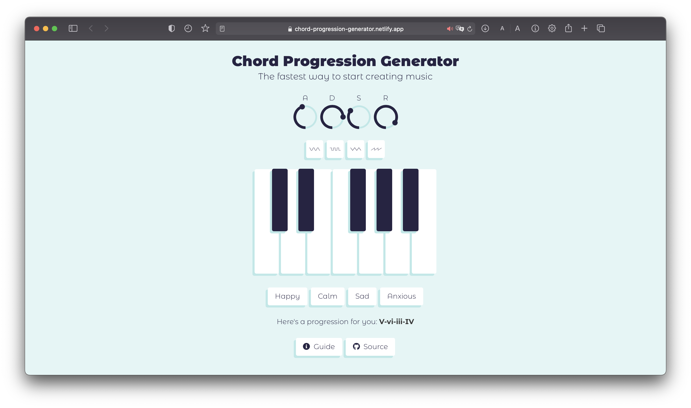

# ChordPro

**_Front end synthesizer to play the chord progressions generated by the [Chord-Progression-Generator-API](https://github.com/gauthammk/Chord-Progression-Generator-API)_**

  

## Live Demo

Access the live demo here: https://chord-progression-generator.netlify.app/

## Getting Started

1. Setup project with `npm install`
2. Compile for development with `npm run serve`
3. Compile and minify for production with `npm run build`
4. Lint and fix files with `npm run lint`

## Customize Configuration

See [Configuration Reference](https://cli.vuejs.org/config/).

## Resources

- Audio synthesizing with [Tone.js](https://tonejs.github.io/)
- Styling with [Bulma](https://bulma.io/)
- Icons from [The Noun Project](https://thenounproject.com/)

## Contributing

Pull requests are welcome. For major changes, please open an issue first to discuss what you would like to change.
